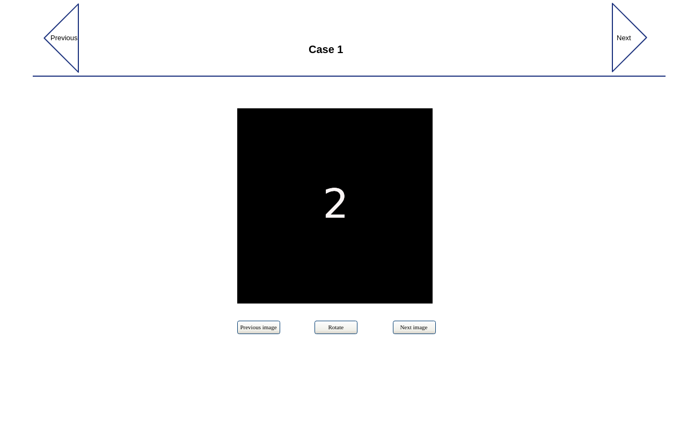

# vv-test

## Objective

The objective of the excerise is to create a simple React and backend app for viewing the images in the data folder,

The example data sets consist of samples *case-1* and *case-2*, which in turn consist of n images.



### Navigation
The upper navigation arrows (*Previous, Next*) switch between datasets in alphabetical order (*case-1, case-2, case-n*). The title is the name of the case (*case-1*).

The buttons below the image (*Previous image, Next image*) flip through the image set alphabetically (*0.png, 1.png, n.png* etc.), and are either disabled at the beginning or end of the images set, or respectively jump directly to the beginning or end .

Landing on the frontpage shows the first case and first image.

###Rotation

By pressing the rotate button, the image in view rotates clockwise 90 degrees, and can be rotated a full 360 degrees by clicking it four times.

###Backend configuration

A simple yaml file with a single key-value pair ```datafolder: /path/to/data``` pointing to the given data folder is sufficient.


## Requirements
### Tools

The frontend part is expected to be React, while the backend app/lib/tool choices are flexible.

### Documentation

Simple user guide describing installation, configuration and running the application. 

### Coding style

Readable.

### Commits

Please commit changes with comments, not the entire solution at one go once it's ready.

### Publishing

Once done, publish the result under your own Github account and provide URL to us. 


### Extra points
- Dockerfile/s
- Unit tests


